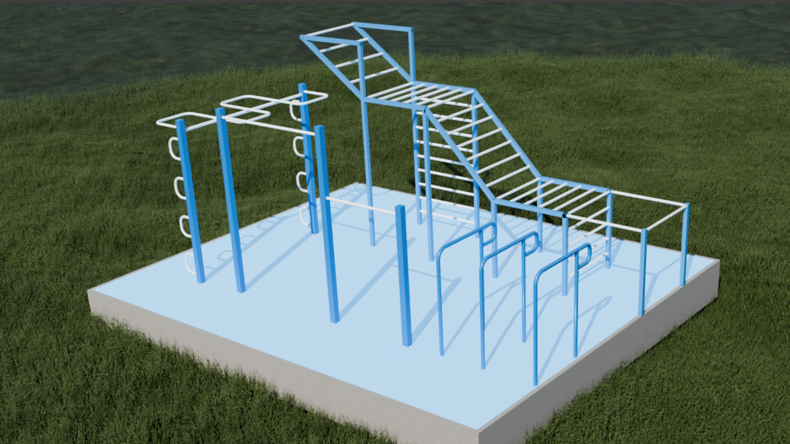
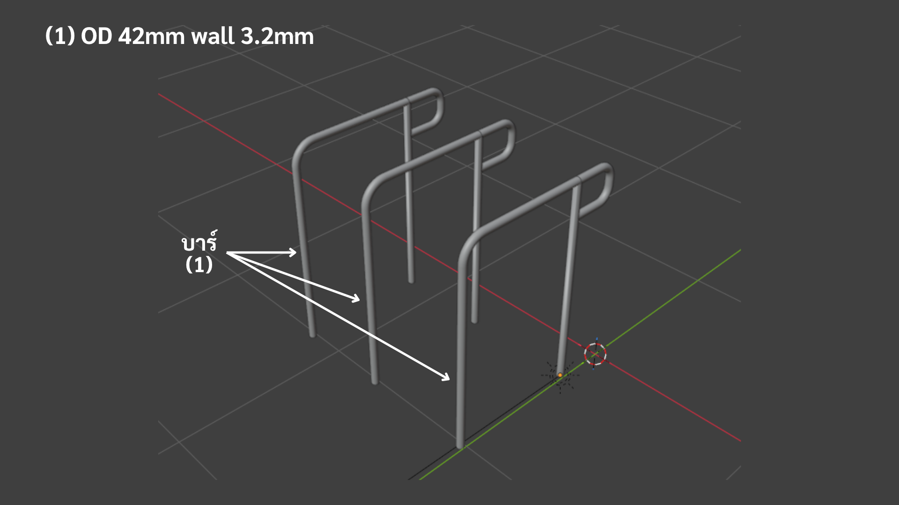
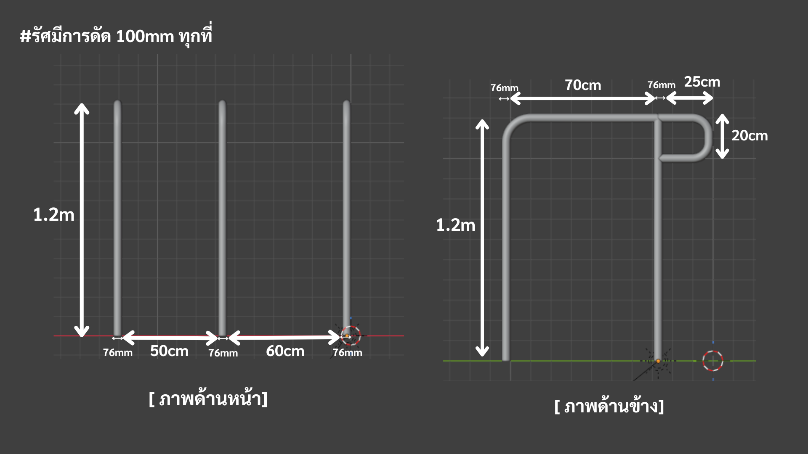
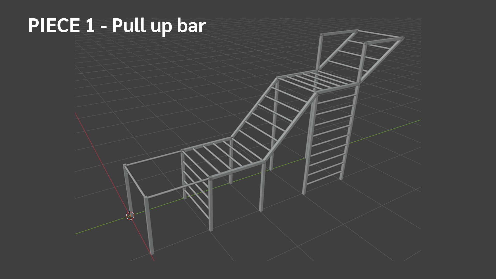
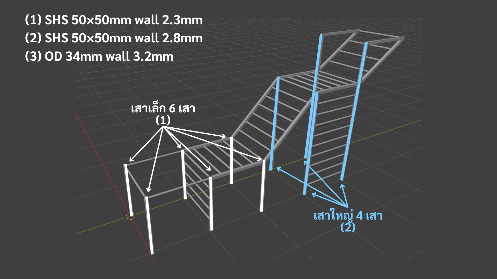
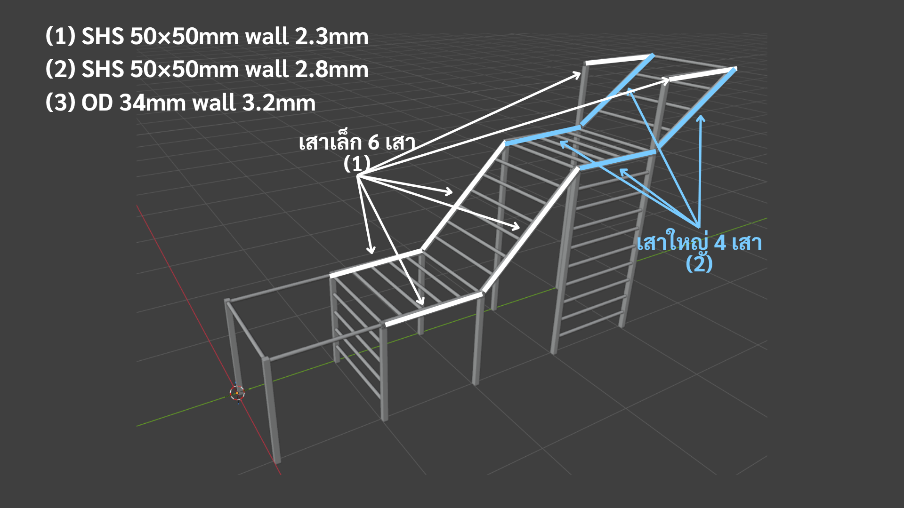
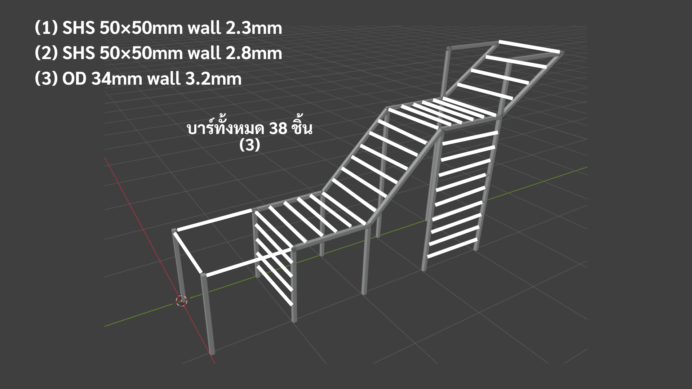

<div align="center">

# 🏋️ สนามคาลิสเทนิกส์กลางแจ้ง

**เอกสารออกแบบและงานค้นคว้าทางวิศวกรรม สำหรับสนามคาลิสเทนิกส์หลังบ้านแบบถาวร**

[](#สถานะและความรับผิดชอบ)
[](#มาตรฐาน)
[](README.md)
[](models/)
[](#สถานะและความรับผิดชอบ)



[English](README.md) · 🌐 **ไทย**

</div>

> [!IMPORTANT]
> **จัดทำโดยผู้ออกแบบฟังก์ชันการใช้งาน — มิใช่วิศวกรผู้ได้รับใบอนุญาต** เอกสารทุกฉบับเป็นแบบเชิงการใช้งานและงานค้นคว้าที่รวบรวมจากแหล่งข้อมูลสาธารณะ (มาตรฐาน EN · เอกสารผู้ผลิต · แคตตาล็อกร้านค้า) ส่งมอบในลักษณะ **"ตามที่เป็น" (as-is) ไม่รับประกันความถูกต้อง** · **มิใช่การคำนวณโครงสร้างที่ผ่านการรับรอง** และไม่ใช่การอนุญาตให้ก่อสร้าง · ต้องให้วิศวกรผู้ได้รับใบอนุญาตตรวจสอบ คำนวณ รับรอง และตรวจหน้างานก่อนก่อสร้าง — **โดยเฉพาะก่อนให้เด็กใช้งาน**

---

## สารบัญ

- [ภาพรวม](#ภาพรวม)
- [อุปกรณ์](#อุปกรณ์)
- [พื้นฐานทางวิศวกรรม](#พื้นฐานทางวิศวกรรม)
- [สถานะและความรับผิดชอบ](#สถานะและความรับผิดชอบ)
- [ชุดเอกสาร](#ชุดเอกสาร)
- [โครงสร้างที่เก็บไฟล์](#โครงสร้างที่เก็บไฟล์)
- [มาตรฐาน](#มาตรฐาน)
- [แกลเลอรี](#แกลเลอรี)
- [License](#license)

---

## ภาพรวม

ชุดเอกสารออกแบบและงานค้นคว้าสำหรับ **สนามออกกำลังกายคาลิสเทนิกส์กลางแจ้ง** ในบ้านพักอาศัย สำหรับผู้ใหญ่ 1 คนและเด็กเล็ก (~5 ขวบ): โครงสร้างเหล็กเชื่อม 4 ชิ้นและพื้นยางกันกระแทก พร้อมโมเดล 3 มิติที่สร้างใน Blender และชุดเอกสารทางการครบชุด (แบบ · การวิเคราะห์การรับแรง · ผลตรวจสอบ · ฐานราก · งานค้นคว้าจัดหาวัสดุ · เอกสารส่งมอบ/ความรับผิด)

|                   |                                                                           |
| ----------------- | ------------------------------------------------------------------------- |
| **ประเภท**        | สนามคาลิสเทนิกส์/สตรีทเวิร์คเอาท์กลางแจ้งถาวร                             |
| **พื้นที่**       | แปลง ~6 × 5 ม. (30 ตร.ม.) · พื้นที่ใช้งานจริง ~5 × 4 ม.                   |
| **ผู้ใช้**        | ผู้ใหญ่ 1 + เด็ก 1 (~5 ขวบ)                                               |
| **วัสดุ**         | เหล็กชุบกัลวาไนซ์จุ่มร้อนทั้งหมด · พื้นยาง EPDM                           |
| **โมเดล**         | โมเดล 3 มิติสร้างใน Blender (ผ่าน BlenderMCP)                             |
| **มาตรฐานออกแบบ** | EN 16630:2015 (อุปกรณ์ฟิตเนสกลางแจ้ง) + EN 1176 (ความปลอดภัยสนามเด็กเล่น) |

---

## อุปกรณ์

โครงสร้างเหล็กเชื่อม 4 ชิ้น + พื้นยางกันกระแทก

| ชิ้น                              | สรุป                                                                                                             | วัสดุหลัก                  |
| --------------------------------- | ---------------------------------------------------------------------------------------------------------------- | -------------------------- |
| **Pull-up bar (บาร์โหน)**         | 3 เสา · บาร์ผู้ใหญ่ z = 2.20 ม. (ช่วง 1.5 ม.) + บาร์เด็ก z = 1.50 ม.                                             | เสา SHS 76 · บาร์ OD 34    |
| **Snake bar (บาร์งู)**            | 2 เสา · คานตรงรับโครงสร้าง + บาร์จับลอนคลื่น (4 ลูก, path ~5.73 ม.) + ราวจับข้างทั้งสองฝั่ง                      | เสา SHS 76 · OD 42 + OD 34 |
| **Dip bar (บาร์ดิป)**             | 3 โครง ⊓ · 2 ช่องจับ (60 ซม. อก / 50 ซม. ไตรเซ็ป) + มือจับ C-handle                                              | OD 42                      |
| **Monkey + flying bar (บาร์ลิง)** | ยาว 5 ม. 5 โซน · ทางเข้าต่ำ → ไต่ 45° → ราบ → ลอน "flying" 35° ขึ้นถึง 2.70 ม. · 35 ซี่ + ค้ำยันสามเหลี่ยมที่ยอด | เสา SHS 50 · ซี่ OD 34     |
| **พื้นยาง**                       | EPDM 25 มม. (40–50 มม. ใต้โซนตกของ monkey/pull-up) · ~20 ตร.ม. · กำหนดระดับยืน (datum z = 0)                     | EPDM / SBR กันยูวี         |

---

## พื้นฐานทางวิศวกรรม

> การประเมินเบื้องต้น (first-order) เพื่อให้วิศวกรผู้รับรองตรวจสอบและยืนยัน — มิใช่การคำนวณโครงสร้างฉบับสมบูรณ์

- **โหลดออกแบบ** — EN 16630:2015 Table 1: **1,942 N ต่อจุดใช้งาน** (รวมตัวคูณพลศาสตร์ C_dyn = 2.0 แล้ว) · ผู้ใช้พร้อมกัน 2 คน = 2,722 N
- **ผลตรวจ** — ภายใต้โหลดมาตรฐานและผนังตามสเปก (3.2 มม.) **ทุกชิ้นส่วนผ่านการตรวจเบื้องต้น (first-order) — ไม่มีชิ้นใดคราก** · โครงสร้างหลัก (เสา ฐานราก สลัก) อยู่ที่ utilisation ต่ำ (~0.2–0.5)
- **6 จุดเฝ้าระวัง** สำหรับวิศวกรผู้รับรอง: (1) **ค้ำยันสามเหลี่ยม** monkey bar โซน 4 — เสา 2.70 ม. ผ่านได้เพราะมีค้ำยัน; (2) บาร์โหนสูง (OD 34, 1.5 ม. — margin ปานกลาง); (3) ชิ้นยื่นราวจับข้าง snake และ nub dip; (4) เสถียรภาพด้านข้างโครง dip; (5) คุณภาพรอยเชื่อมจุดรับแรงพลวัต; (6) ความหนายางกันตก
- **ฐานราก** — แผ่นฐานเชื่อม 9 มม. + **สลัก M12×120 ชุบกัลวาไนซ์จุ่มร้อน** ลงพื้นคอนกรีต C20/25 หนา ≥ 140 มม. (รวม 21 แผ่น · 72 สลัก)
- **การประกอบ** — ประกอบย่อย **เชื่อมในโรงงาน → ชุบกัลวาไนซ์ทั้งชิ้น → ขันสลักหน้างาน** ผ่าน end plate (รักษาชั้นเคลือบ) · ทุกชิ้นกลวงปิดต้องเจาะ **รูระบาย** ก่อนชุบ

---

## สถานะและความรับผิดชอบ

> [!WARNING]
> เอกสารเหล่านี้ไม่ใช่การอนุญาตให้ก่อสร้าง · วิศวกรผู้ได้รับใบอนุญาต (**ฝ่าย ค**) ต้องทบทวน คำนวณ รับรอง และตรวจหน้างาน — รอยเชื่อม ฐานราก สลัก — **ก่อนเปิดใช้งาน โดยเฉพาะก่อนให้เด็กใช้**

- เอกสารทั้งหมดเป็น **แบบเชิงการใช้งาน + งานค้นคว้าเบื้องต้น** รวบรวมจากแหล่งสาธารณะ ส่งมอบ **ตามที่เป็น ไม่รับประกัน** — **มิใช่** การคำนวณวิศวกรรมที่ผ่านการรับรอง
- โปรเจกต์จัดโครงสร้างเป็น **4 ฝ่าย**:

| ฝ่าย  | บทบาท                                       | หน้าที่                          |
| ----- | ------------------------------------------- | -------------------------------- |
| **ก** | ผู้ค้นคว้า                                  | รวบรวมแบบและข้อมูล               |
| **ข** | ผู้ประสานงาน                                | เสนอแบบต่อเจ้าของ                |
| **ค** | เจ้าของ / วิศวกรผู้ได้รับใบอนุญาต / ผู้ตรวจ | ทบทวน รับรอง อนุมัติ และจ้างช่าง |
| **ง** | ช่างก่อสร้าง                                | สร้างตามแบบที่อนุมัติ            |

---

## ชุดเอกสาร

มี 2 ชุดคู่ขนาน: **ภาษาอังกฤษ** ใน [`final1-en/`](final1-en/) และ **ภาษาไทย (source of truth)** ใน [`final1-th/`](final1-th/) · เริ่มที่สารบัญ แล้วเปิดเอกสารแต่ละฉบับเมื่อต้องการรายละเอียด

| เอกสาร                                                                                | คืออะไร                                                                                   |
| ------------------------------------------------------------------------------------- | ----------------------------------------------------------------------------------------- |
| **[สารบัญรวม — TOC](final1-th/toc.md)**                                               | แผนผังนำทาง + ลำดับการอ่านที่แนะนำ                                                        |
| [แกลเลอรีภาพออกแบบ (1/4)](final1-th/design/design.gallery.md)                         | ภาพเรนเดอร์ 3 มิติ 16 ภาพ แสดงรูปทรงและการจัดวาง                                          |
| [แบบและข้อกำหนด (2/4)](final1-th/spec.full.md)                                        | รูปทรง ขนาด ความสูง วัสดุ PIECE 1–5 + วิธีประกอบ                                          |
| [การวิเคราะห์การรับแรง (3/4)](final1-th/spec.requirement.md)                          | ผู้ใช้ลงแรงแต่ละชิ้นอย่างไร · demand เทียบ capacity                                       |
| [สรุปผลตรวจสอบและฐานราก (4/4)](final1-th/spec.summary.md)                             | ผล utilisation · ระบบฐานราก/สลัก · ทางแก้ · รายการสั่งซื้อ                                |
| [เครื่องมือกะวัสดุขั้นต่ำ](final1-th/spec.minimum.md)                                 | เครื่องมือคัดวัสดุร้านที่เล็กเกิน — _มิใช่สเปกก่อสร้าง_                                   |
| [งานค้นคว้าอ้างอิง](final1-th/research.md)                                            | ที่มาของทุกตัวเลข — EN 16630, สลัก Hilti, สำรวจ 9 แบรนด์                                  |
| [งานค้นคว้าระบบต่อ (เชื่อมโรง/ขันหน้างาน)](final1-th/research.connection-assembly.md) | ระบบ end plate, รูระบาย, แรงบิด                                                           |
| [ขอบเขตและความรับผิด — ข้อตกลงภายใน ก/ข](final1-th/policy.liability.md)               | บทบาทและการแบ่งความรับผิดระหว่างผู้ค้นคว้ากับผู้ประสานงาน                                 |
| [หนังสือส่งมอบแบบ](final1-th/policy.handoff.md)                                       | หนังสือรับทราบบทบาทให้เจ้าของ/วิศวกร (ฝ่าย ค) เซ็น                                        |
| [สรุปส่งต่อ (TL;DR)](final1-th/tldr.b.md)                                             | [สำหรับผู้ประสานงาน](final1-th/tldr.b.md) และ [สำหรับเจ้าของ/วิศวกร](final1-th/tldr.c.md) |

> [!NOTE]
> **เริ่มที่ไหน** — เจ้าของ/วิศวกร → [tldr.c.md](final1-th/tldr.c.md) (อ่าน 2–3 นาที) · ผู้ประสานงาน → [tldr.b.md](final1-th/tldr.b.md) · คนอื่น → [toc.md](final1-th/toc.md)

---

## โครงสร้างที่เก็บไฟล์

```
calisthenic-design/
├── final1-en/      → ชุดเอกสารภาษาอังกฤษ
├── final1-th/      → ชุดเอกสารภาษาไทย — source of truth
├── archive/        → เอกสารรุ่นเก่า (อ้างอิงเท่านั้น — ห้ามใช้สร้างจริง)
├── models/
│   ├── final1-blender/ → ไฟล์ Blender ชุดปัจจุบัน + main scene
│   └── archive/        → prototype ทุก version + layout ทดลอง 3 แบบ
├── renders/        → ภาพ render + วิดีโอเดินชม
├── scripts/        → สคริปต์ Python render/gif
├── assets/         → HDRI แสงสภาพแวดล้อม
├── README.md       → ไฟล์หลัก (อังกฤษ)
├── README-th.md    → ไฟล์นี้ (ไทย)
└── CLAUDE.md       → บันทึกการทำงานสำหรับผู้ช่วย AI
```

> renders และ assets ถูก `.gitignore` · git เก็บเอกสาร `.md`, ภาพแบบ/PDF ใน `final1-*/design/`, และไฟล์ `.blend` ทั้งหมดใน `models/`

---

## โมเดล 3 มิติ (Blender)

สร้างใน [Blender](https://www.blender.org/) ผ่าน BlenderMCP · ไฟล์ `.blend` ทั้งหมด track ไว้ใน `models/` · แกลเลอรีด้านล่างคือภาพเรนเดอร์ที่ export จากแบบสุดท้าย

**`models/final1-blender/`** — แบบปัจจุบัน (ที่เอกสาร `final1-*` อ้างอิง)

| ไฟล์ | ชิ้นงาน |
| ---- | ------- |
| `pullup_bar_v2.blend` | Pull-up bar — 3 เสา · บาร์ผู้ใหญ่ (z = 2.20 ม.) + บาร์เด็ก (z = 1.50 ม.) |
| `snake_bar_v5.blend` | Snake bar — คานตรงรับโครง + บาร์ลอนคลื่น 4 ลูก + ราวจับข้างทั้งสองด้าน |
| `dip_bar_v3.blend` | Dip bar — 3 โครง ⊓ · ช่องจับอก/ไตรเซ็ป + มือจับ C-handle nub |
| `monkey_flying_bar_v4.blend` | Monkey + flying bar — 5 โซน · 35 ซี่ · ค้ำยันสามเหลี่ยมที่ยอด |
| `floor_v1.blend` | พื้นคอนกรีต — แผ่น 6 × 5 ม. |
| `final_main_scene.blend` | Main scene — ลิงก์และจัดตำแหน่งทุกชิ้นเข้าด้วยกัน |

**`models/archive/`** — prototype ทุก version · `final1-blender/` หยิบใช้แค่ version เดียวของแต่ละชิ้น

| ไฟล์ | หมายเหตุ |
| ---- | -------- |
| `pullup_bar_v1–v2.blend` | Pull-up bar ทุก iteration |
| `snake_bar_v1–v5.blend` | Snake bar ทุก iteration |
| `dip_bar_v1–v3.blend` | Dip bar ทุก iteration |
| `monkey_flying_bar_v1–v5.blend` | Monkey + flying bar ทุก iteration |
| `floor_v1.blend` | พื้นคอนกรีต (เหมือน final) |
| `main_scene.blend` · `main_scene2.blend` · `main_scene3.blend` | layout ทดลอง 3 แบบ (แบบที่ 4 คือ `final_main_scene.blend` ใน `final1-blender/`) |

---

## มาตรฐาน

EN 16630:2015 (อุปกรณ์ฟิตเนสกลางแจ้ง) · EN 1176 (ความปลอดภัยสนามเด็กเล่น) · EN 1993 / Eurocode 3 (โครงสร้างเหล็กและจุดต่อ) · Hilti HSA wedge anchor ETA-11/0374 · ASTM A385 / EN ISO 1461 (การชุบกัลวาไนซ์จุ่มร้อน)

---

## แกลเลอรี

ภาพเรนเดอร์ 3 มิติแสดงรูปทรง สัดส่วน และการจัดวาง — เพื่อการสื่อสารเท่านั้น **มิใช่แบบก่อสร้าง** · ดูฉบับเต็มที่ **[แกลเลอรีภาพออกแบบ (1/4)](final1-th/design/design.gallery.md)**

<b>📸 ดูภาพเรนเดอร์ทั้ง 16 ภาพ</b>
<br>










---

## License

[MIT License](LICENSE) — ใช้/ดัดแปลง/แชร์ได้ฟรี **ขอแค่ใส่เครดิต** Jakkarin Promsee ([@Jakkarin-Promsee](https://github.com/Jakkarin-Promsee))

เอกสารทั้งหมดเป็น **functional design และงานค้นคว้า ให้แบบ as-is ไม่รับประกันและไม่รับผิดใดๆ** — มิใช่วิศวกรรมที่รับรองแล้ว · ต้องให้วิศวกรผู้ได้รับใบอนุญาตตรวจและรับรองก่อนก่อสร้าง · ดู disclaimer ฉบับเต็มใน [LICENSE](LICENSE)

---

<div align="center">
<sub>แบบเชิงการใช้งานและงานค้นคว้า · รวบรวมจากแหล่งข้อมูลสาธารณะ · <b>มิใช่เอกสารวิศวกรรมที่ผ่านการรับรอง</b></sub>
</div>
