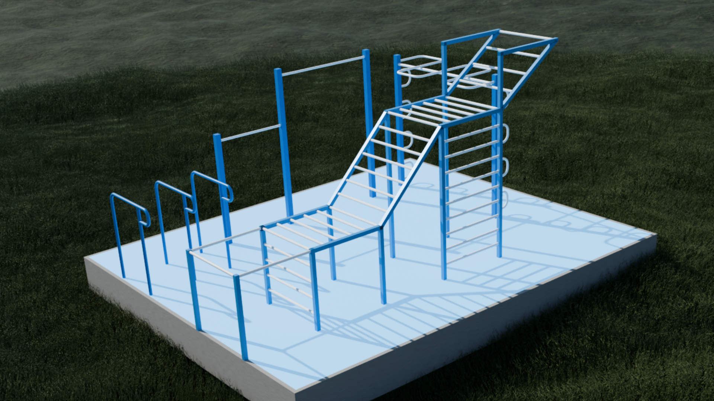
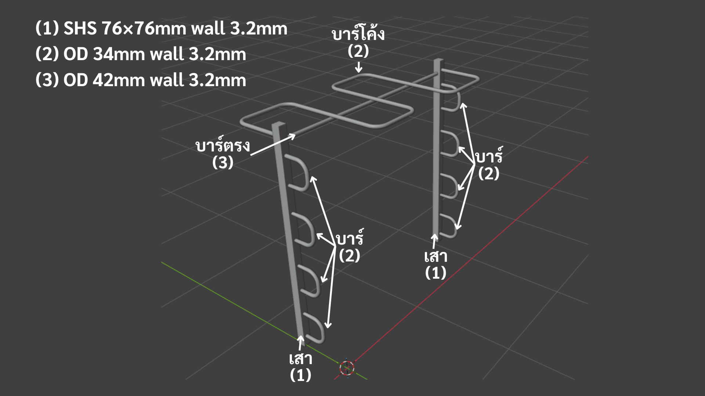
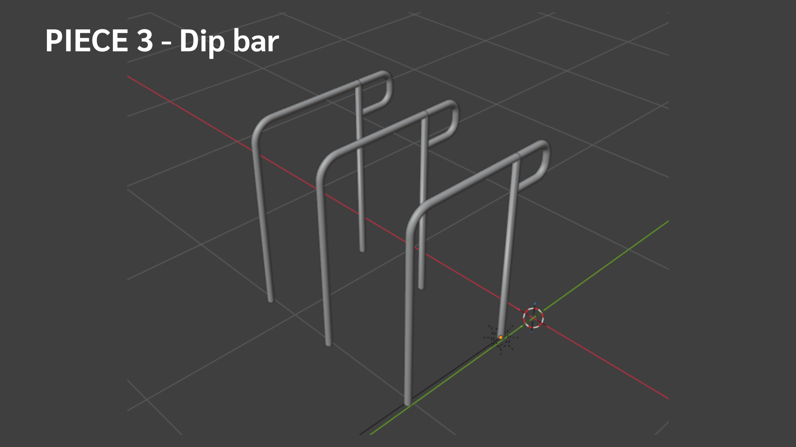

<div align="center">

# 🏋️ Outdoor Calisthenics Gym

**Design &amp; engineering-research documentation for a permanent backyard calisthenics gym**

[](#status-and-responsibility)
[](#standards)
[](README-th.md)
[](models/)
[](#status-and-responsibility)


🌐 **English** · [ภาษาไทย](README-th.md)

</div>

> [!IMPORTANT]
> **Prepared by a Functional Design Researcher — not a licensed engineer.** Everything here is functional design and research compiled from publicly available sources (EN standards, manufacturer datasheets, supplier catalogues), provided **as-is, with no warranty**. It is **not a certified structural calculation** and does not authorise construction. A licensed professional engineer must review, calculate, certify, and inspect the design before construction — **especially before any child uses the equipment.**

---

## Contents

- [Overview](#overview)
- [Equipment](#equipment)
- [Engineering basis](#engineering-basis)
- [Status and responsibility](#status-and-responsibility)
- [Document set](#document-set)
- [Repository layout](#repository-layout)
- [Standards](#standards)
- [Gallery](#gallery)

---

## Overview

A complete design-and-research package for a permanent **outdoor calisthenics gym** in a private back garden, built for an adult plus a young child (~5 years): four welded-steel training structures and an impact-absorbing rubber floor, with 3D models built in Blender and a full set of formal documents (design, load analysis, verification, foundations, sourcing research, and handover/liability paperwork).

|                     |                                                                         |
| ------------------- | ----------------------------------------------------------------------- |
| **Type**            | Permanent outdoor calisthenics / street-workout gym                     |
| **Site**            | ~6 × 5 m plot (30 m²) · usable equipment area ~5 × 4 m                  |
| **Users**           | 1 adult + 1 child (~5 years)                                            |
| **Material**        | Hot-dip galvanised steel throughout · EPDM rubber safety floor          |
| **Modelling**       | 3D models built in Blender (via BlenderMCP)                             |
| **Design standard** | EN 16630:2015 (outdoor fitness equipment) + EN 1176 (playground safety) |

---

## Equipment

Four welded-steel structures plus an impact-absorbing rubber floor.

| Piece                   | Summary                                                                                                                        | Key materials                |
| ----------------------- | ------------------------------------------------------------------------------------------------------------------------------ | ---------------------------- |
| **Pull-up bar**         | 3 posts · adult bar at z = 2.20 m (1.5 m span) + child bar at z = 1.50 m                                                       | Posts SHS 76 · bars OD 34    |
| **Snake bar**           | 2 posts · structural straight bar + wavy grip bar (4 loops, ~5.73 m path) + side U-grips both sides                            | Posts SHS 76 · OD 42 + OD 34 |
| **Dip bar**             | 3 × ⊓-frames · two grip channels (60 cm chest / 50 cm triceps) + C-handle nubs                                                 | OD 42                        |
| **Monkey + flying bar** | 5 m long, 5 zones · low entry → 45° climb → flat → 35° "flying" incline up to 2.70 m · 35 rungs + a triangle brace at the apex | Posts SHS 50 · rungs OD 34   |
| **Rubber floor**        | EPDM 25 mm (40–50 mm under the monkey/pull-up fall zones) · ~20 m² · sets the standing datum (z = 0)                           | EPDM / SBR, UV-resistant     |

---

## Engineering basis

> A preliminary, first-order assessment intended for the certifying engineer to review and verify — not a final structural calculation.

- **Design load** — EN 16630:2015 Table 1: **1,942 N per user station** (dynamic factor C_dyn = 2.0 already included); two simultaneous users = 2,722 N.
- **Verdict** — under the standard load and specified walls (3.2 mm), **all members pass the preliminary first-order check — none yield.** The primary structure (posts, foundations, anchors) sits at low utilisation (≈ 0.2–0.5).
- **6 watch points** flagged for the certifying engineer: (1) the monkey-bar **triangle brace** at Zone 4 — the 2.70 m post only passes because of it; (2) the pull-up high bar (OD 34, 1.5 m — moderate margin); (3) the snake side-grip and dip-nub cantilevers; (4) dip-frame lateral stability; (5) weld quality at dynamic load points; (6) fall-safety rubber thickness.
- **Foundations** — 9 mm welded base plates + **M12×120 hot-dip-galvanised wedge anchors** into a C20/25 concrete slab ≥ 140 mm thick (21 plates · 72 anchors).
- **Assembly** — sub-assemblies are **shop-welded → hot-dip galvanised as whole pieces → field-bolted** on site through end plates, keeping the coating intact; every sealed hollow section gets a **vent hole** before galvanising.

---

## Status and responsibility

> [!WARNING]
> These documents do not authorise construction. The licensed engineer (**Party C**) must review, calculate, certify, and physically inspect — welds, foundations, and anchors — **before opening for use, and especially before any child uses the equipment.**

- All documents are **preliminary functional design + research**, compiled from public sources and delivered **as-is, with no warranty** — they are **not** certified engineering calculations.
- The project is organised around **four roles**:

| Role  | Party                                 | Responsibility                                      |
| ----- | ------------------------------------- | --------------------------------------------------- |
| **A** | Researcher                            | Compiles the design and data                        |
| **B** | Coordinator                           | Proposes the design to the owner                    |
| **C** | Owner / Licensed Engineer / Inspector | Reviews, certifies, approves, and hires the builder |
| **D** | Contractor                            | Builds to the approved design                       |

---

## Document set

Two parallel formal sets — **English** in [`final1-en/`](final1-en/) and **Thai (source of truth)** in [`final1-th/`](final1-th/). Begin at the index, then open individual documents only for detail.

| Document                                                                                  | What it is                                                                                                     |
| ----------------------------------------------------------------------------------------- | -------------------------------------------------------------------------------------------------------------- |
| **[Master index — TOC](final1-en/toc.md)**                                                | Navigation map + recommended reading order                                                                     |
| [Design gallery (1/4)](final1-en/design/design.gallery.md)                                | 16 × 3D renders showing form and layout                                                                        |
| [Design specification (2/4)](final1-en/spec.full.md)                                      | Form, dimensions, heights, materials for PIECE 1–5 + the assembly method                                       |
| [Load &amp; requirement analysis (3/4)](final1-en/spec.requirement.md)                    | How users load each piece · member demand vs capacity                                                          |
| [Verification summary &amp; foundation (4/4)](final1-en/spec.summary.md)                  | Utilisation results · foundation/anchor system · remedies · bill of materials                                  |
| [Material minimum worksheet](final1-en/spec.minimum.md)                                   | Working tool to screen out undersized shop stock — _not a construction spec_                                   |
| [Reference research](final1-en/research.md)                                               | Source of every figure — EN 16630, Hilti anchors, a 9-brand survey                                             |
| [Connection research (shop-weld / field-bolt)](final1-en/research.connection-assembly.md) | End-plate system, vent holes, torque                                                                           |
| [Scope &amp; liability — internal A/B agreement](final1-en/policy.liability.md)           | Roles and liability allocation between researcher and coordinator                                              |
| [Design handover letter](final1-en/policy.handoff.md)                                     | Acknowledgement letter for the owner/engineer (Party C) to sign                                                |
| [Handover summaries](final1-en/tldr.b.md)                                                 | TL;DR overviews — [for the coordinator](final1-en/tldr.b.md) and [for the owner/engineer](final1-en/tldr.c.md) |

> [!NOTE]
> **Where to start** — owner/engineer → [tldr.c.md](final1-en/tldr.c.md) (a 2–3-minute read) · coordinator → [tldr.b.md](final1-en/tldr.b.md) · everyone else → [toc.md](final1-en/toc.md).

---

## Repository layout

```
calisthenic-design/
├── final1-en/      → English deliverable (this README links here)
├── final1-th/      → Thai deliverable — source of truth
├── archive/        → superseded drafts (reference only — do not build from these)
├── models/
│   ├── final1-blender/ → current Blender piece files + main scene (git-ignored)
│   └── ...             → older version files (git-ignored)
├── renders/        → still renders + walkthrough animation
├── scripts/        → Python render/gif scripts
├── assets/         → HDRI environment lighting
├── README.md       → this file (English, primary)
├── README-th.md    → Thai version
└── CLAUDE.md       → working notes for the AI assistant
```

> `.blend` files, renders, and assets are git-ignored; only the `.md` documents and the design images/PDF under `final1-*/design/` are tracked.

---

## 3D Models (Blender)

Built in [Blender](https://www.blender.org/) via BlenderMCP. Source files live in `models/final1-blender/` (git-ignored; the gallery below shows renders exported from them).

| File | Piece |
| ---- | ----- |
| `pullup_bar_v2.blend` | Pull-up bar — 3 posts · adult bar (z = 2.20 m) + child bar (z = 1.50 m) |
| `snake_bar_v5.blend` | Snake bar — structural straight bar + 4-loop wave grip + side U-grips both sides |
| `dip_bar_v3.blend` | Dip bar — 3 × ⊓-frames · chest / triceps channels + C-handle nubs |
| `monkey_flying_bar_v4.blend` | Monkey + flying bar — 5 zones · 35 rungs · triangle brace at apex |
| `floor_v1.blend` | Concrete slab — 6 × 5 m platform |
| `final_main_scene.blend` | Main scene — all pieces linked and positioned together |

---

## Standards

EN 16630:2015 (outdoor fitness equipment) · EN 1176 (playground safety) · EN 1993 / Eurocode 3 (structural steel &amp; joints) · Hilti HSA wedge anchor ETA-11/0374 · ASTM A385 / EN ISO 1461 (hot-dip galvanising).

---

## Gallery

3D renders showing form, scale, and layout — illustrative only, **not construction drawings**. Full annotated set: **[Design Gallery (1/4)](final1-en/design/design.gallery.md)**.

<b>📸 View all 16 renders</b>
<br>










---

<div align="center">
<sub>Functional design &amp; research · compiled from public sources · <b>not a certified engineering document</b></sub>
</div>
