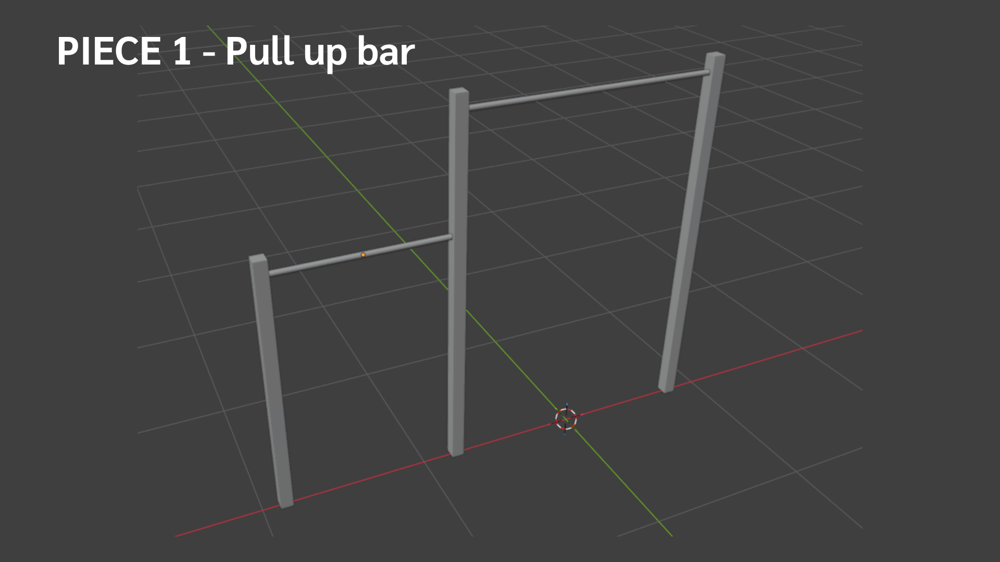
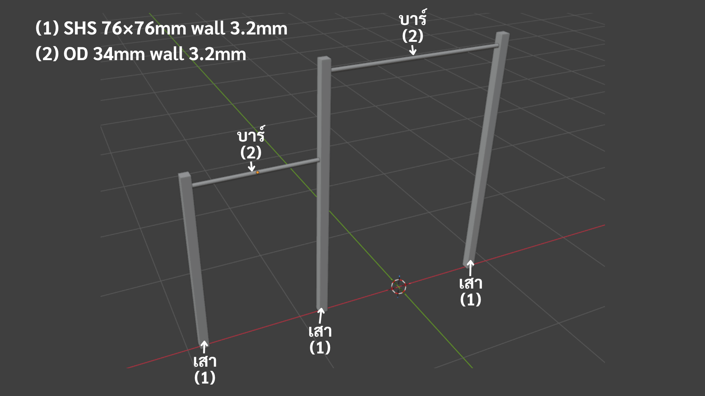
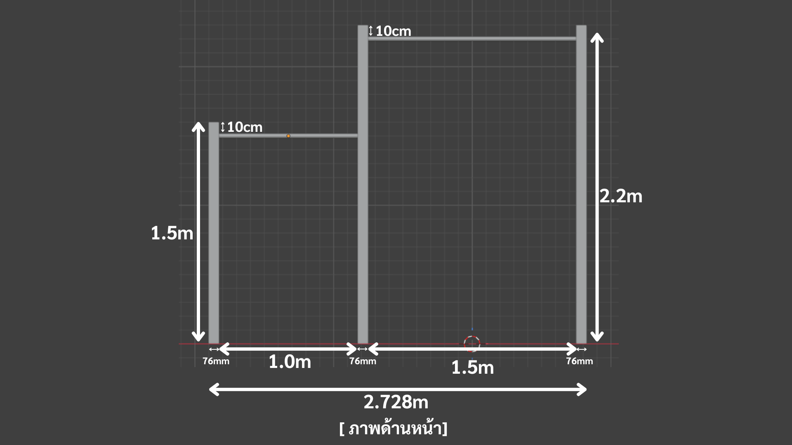
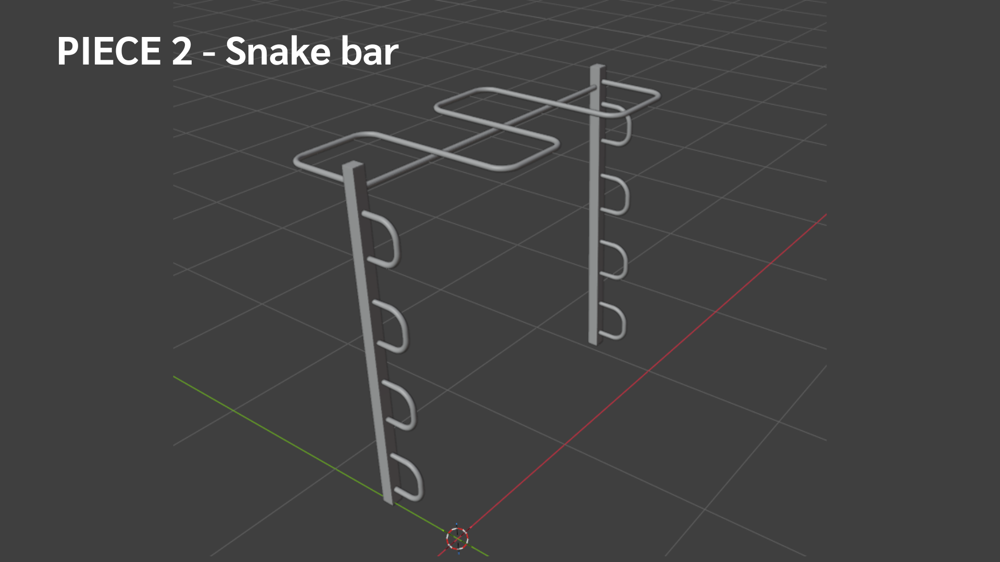
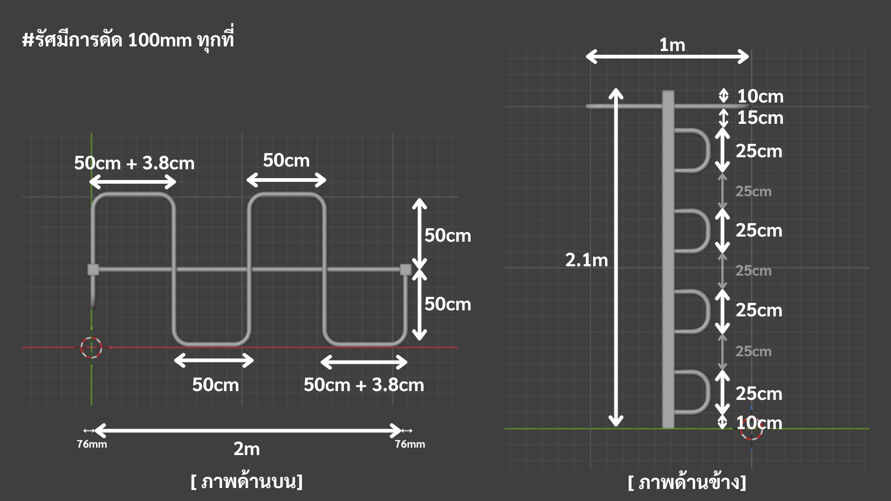
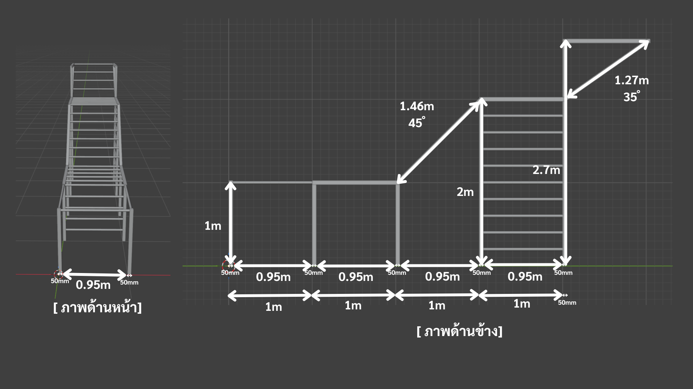

# แกลเลอรีภาพออกแบบ — สนามคาลิสเทนิกส์กลางแจ้ง

## เอกสาร 1/4 · Design Gallery (ฉบับร่าง 1)

| หัวข้อ            | รายละเอียด                                                                                                                                                                              |
| ----------------- | --------------------------------------------------------------------------------------------------------------------------------------------------------------------------------------- |
| สถานะเอกสาร       | ฉบับร่าง 1 (Draft 1) — ภาพประกอบการออกแบบ เพื่อสื่อสารรูปทรงและการจัดวาง                                                                                                                |
| ปรับปรุงล่าสุด    | 17 มิถุนายน 2569                                                                                                                                                                        |
| จัดทำโดย          | ผู้ออกแบบฟังก์ชันการใช้งาน (มิใช่วิศวกรผู้ได้รับใบอนุญาต)                                                                                                                               |
| ประเภทเนื้อหา     | ภาพเรนเดอร์ 3 มิติและมุมมองประกอบ จำนวน 17 ภาพ                                                                                                                                          |
| ขนาด/มาตราส่วน    | ขนาด ความสูง และวัสดุที่ใช้จริงให้ยึดตาม [แบบและข้อกำหนด (2/4)](../spec.full.md) เป็นหลัก                                                                                               |
| เอกสารชุดเดียวกัน | [สารบัญทั้งหมด (TOC)](../toc.md) · [แบบและข้อกำหนด (2/4)](../spec.full.md) · [การวิเคราะห์การรับแรง (3/4)](../spec.requirement.md) · [สรุปผลตรวจสอบและฐานราก (4/4)](../spec.summary.md) |

> **คำชี้แจง** ภาพในแกลเลอรีนี้เป็นภาพจำลอง 3 มิติเพื่อสื่อสารรูปทรง สัดส่วน และการจัดวางอุปกรณ์เท่านั้น **มิใช่แบบก่อสร้างที่มีมาตราส่วนหรือผ่านการรับรองทางวิศวกรรม** · ค่าตัวเลขขนาด วัสดุ และข้อกำหนดที่ใช้จริงให้ยึดตามชุดแบบ 2/4–4/4 เสมอ

---

